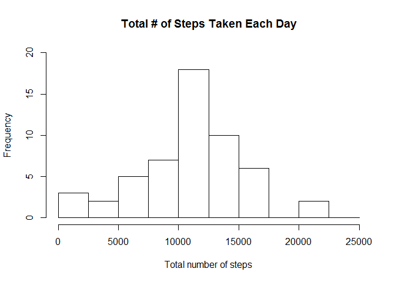
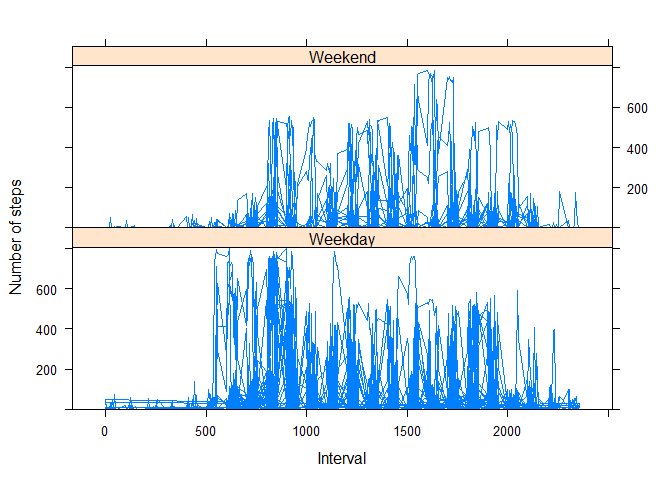

# Reproducible Research: [Peer Assessment 1](https://class.coursera.org/repdata-034/human_grading/view/courses/975147/assessments/3/submissions)
#Introduction

It is now possible to collect a large amount of data about personal movement using activity monitoring devices such as a Fitbit, Nike Fuelband, or Jawbone Up. These type of devices are part of the "quantified self" movement - a group of enthusiasts who take measurements about themselves regularly to improve their health, to find patterns in their behavior, or because they are tech geeks. But these data remain under-utilized both because the raw data are hard to obtain and there is a lack of statistical methods and software for processing and interpreting the data.

This assignment makes use of data from a personal activity monitoring device. This device collects data at 5 minute intervals through out the day. The data consists of two months of data from an anonymous individual collected during the months of October and November, 2012 and include the number of steps taken in 5 minute intervals each day.

##Overview

The analysis consists of the following steps:

* Downloading the data set (performed outside of R)
* Loading the required R libraries
* Loading, modifying and examing the data
* Calculating the total, mean and median steps for all of the data
* Creating a histogram of the total number of steps taken each day
* Visualizing the daily activity pattern
* Determining which 5-minute interval contains the maximum number of steps
* Determining how much data is missing from the original data set
* Adjusting the orginal data set to compensate for missing data
* Recalculating the mean and median steps based on the revised data set
* Visualizing the differences in activity between weekdays and weekends
* Making observations about the data

##Data

The data for this analysis can be downloaded from Coursera:

[Activity monitoring data](https://d396qusza40orc.cloudfront.net/repdata%2Fdata%2Factivity.zip) [52K] 

The variables included in this dataset are:

**steps**: Number of steps taking in a 5-minute interval (missing values are coded as NA)

**date**: The date on which the measurement was taken in YYYY-MM-DD format

**interval**: Identifier for the 5-minute interval in which measurement was taken

The dataset is stored in a comma-separated-value (CSV) file and there are a total of 17,568 observations

## Setup

### Load the required libraries & set options:


```r
library(readr)
library(dplyr)
library(lattice)
options(digits = 2)
```

### Load the raw data, add day / day type (weekday or weekend) and examine the data:


```r
activity_df <- read_csv(file="./activity.zip") 
activity_df$day <- as.factor(weekdays(as.Date(activity_df$date)))
activity_df$daytype <- as.factor(ifelse(activity_df$day %in% c("Saturday","Sunday"), "Weekend", "Weekday"))
activity_df_all <- activity_df # for the 2nd part of the analysis
activity_df <- na.omit(activity_df) # for the 1st part of the analysis
str(activity_df)
```

```
## Classes 'tbl_df' and 'data.frame':	15264 obs. of  5 variables:
##  $ steps   : int  0 0 0 0 0 0 0 0 0 0 ...
##  $ date    : Date, format: "2012-10-02" "2012-10-02" ...
##  $ interval: int  0 5 10 15 20 25 30 35 40 45 ...
##  $ day     : Factor w/ 7 levels "Friday","Monday",..: 6 6 6 6 6 6 6 6 6 6 ...
##  $ daytype : Factor w/ 2 levels "Weekday","Weekend": 1 1 1 1 1 1 1 1 1 1 ...
##  - attr(*, "na.action")=Class 'omit'  Named int [1:2304] 1 2 3 4 5 6 7 8 9 10 ...
##   .. ..- attr(*, "names")= chr [1:2304] "1" "2" "3" "4" ...
```

## What is the mean total number of steps taken per day?

### Calculate the total, mean and median steps for all days:


```r
total_steps_all_days <- sum(activity_df$steps)
mean_steps_all_days <- mean(activity_df$steps)
median_steps_all_days <- median(activity_df$steps)
```

* The total steps taken across all days is **570608**
* The mean steps taken across all days is **37.38**
* The median steps taken across all days is **0**

### Create a histogram of the total number of steps taken each day:


```r
total_steps_per_day <- activity_df[c(1,2)] %>% group_by(date) %>% summarise(total_steps=sum(steps)) 
hist(total_steps_per_day$total_steps,
     breaks=seq(from=0, to=25000, by=2500),
     xlab="Total number of steps", 
     ylim=c(0, 20), 
     main="Total # of Steps Taken Each Day")
```

 

## What is the average daily activity pattern?


```r
average_daily_activity_pattern <- activity_df[c(1,3)] %>% group_by(interval) %>% summarise(mean_activity=mean(steps))
plot (average_daily_activity_pattern$interval,average_daily_activity_pattern$mean_activity,
      type='l',
      xlab="Interval",
      ylab="Mean Steps per Interval",
      main="Average Daily Activity Pattern")
```

 

## Which 5-minute interval, on average across all the days in the dataset, contains the maximum number of steps?


```r
max_steps_row <- which.max(average_daily_activity_pattern$mean_activity)
average_daily_activity_pattern[max_steps_row,]
```
* Interval **835** has the maximum number of steps: **206.17**

## How many missing values are in the data set?


```r
sum(is.na(activity_df_all))
```

**2304** rows contain NA

## Replace the missing values with the mean number of steps for the same day of week

```r
activity_df_fixed <- activity_df_all %>% 
            group_by(day) %>%
            mutate(steps= replace(steps, is.na(steps), mean(steps, na.rm=TRUE)))
```


```r
mean_steps_fixed <- mean(activity_df_fixed$steps)
median_steps_fixed <- median(activity_df_fixed$steps)
```

* With NAs fixed, the mean steps taken across all days is **37.57** (higher)
* With NAs fixed, the median steps taken across all days is **0** (no difference)

## Are there differences in activity patterns between weekdays and weekends?

In this analysis we use the original data frame (i.e, with NAs omitted):


```r
xyplot(activity_df$steps ~ activity_df$interval|activity_df$daytype, data=activity_df, 
       ylim=range(activity_df$steps),
       ylab="Number of steps",  
       xlab="Interval", type="l",
       layout=c(1,2))
```

 

##Observations

The activity time series graph results in two observations:

1. The individuals in the study begin walking later in the day on weekends, i.e. activity doesn't build until around 9am
2. Steps peak earlier in the day on weekdays, i.e between 5am and 10am versus 3pm to 5pm on weekends
