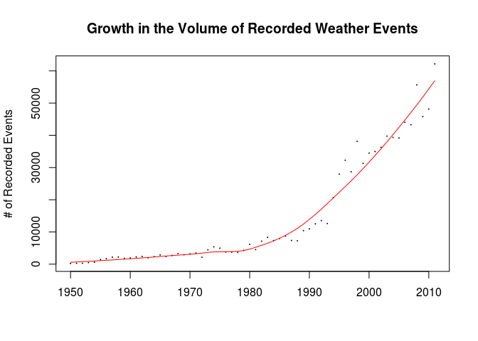
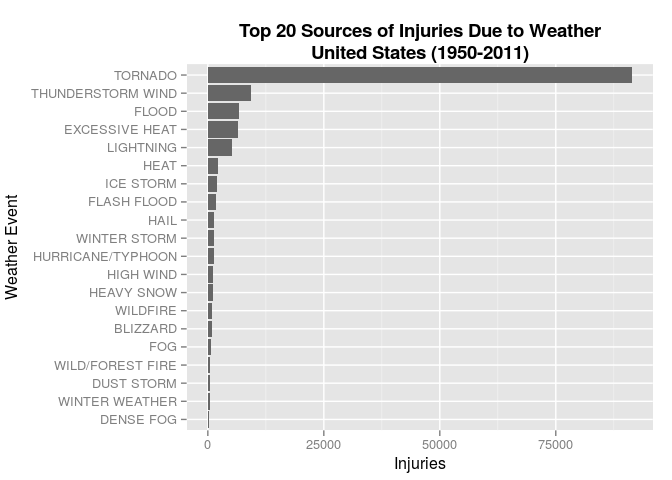
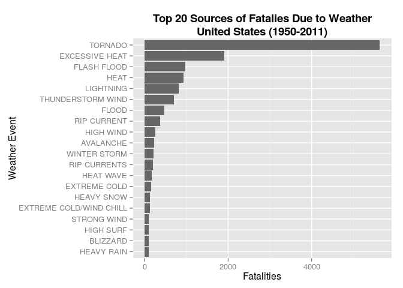

# Economic & Human Impact of Major Weather Events in the United States, 1950-2011

<style type="text/css">
<!--
.indent { margin-left: 125px; }
-->
<!--
.indent2 { margin-left: 300px; }
-->
</style>

 __________________________________________________________________
 
## Synopsis

Storms and other severe weather events can cause both public health and economic problems
for communities and municipalities. Many severe events can result in fatalities, injuries, and
property damage, and preventing such outcomes to the extent possible is a key concern.

This study reviewed the U.S. National Oceanic and Atmospheric Administration's (NOAA) storm 
database. This database tracks characteristics of major storms and weather events in the 
United States, including when and where they occur, as well as estimates of any fatalities, 
injuries, and property damage for the period 1950-2011.

Questions evaluated during this study included:

1. Which storm event types were responsible for the greatest amount of damage to property and crops?
2. Which storm event types were responsible for the greatest number of fatalities?
3. Which storm event types were responsible for the greatest number of injuries?

Because of the time span involved, significant data quality challenges had to be addressed. Despite these issues, the following conclusions can be reasonably drawn:

1. _Floods_ are the most significant cause of economic loss, and the cumulative amount of property damage greatly exceeds that of crop damage
2. _Tornado events_ represent the largest source of peronal injuries
3. _Tornado events_ are also the largest source of fatalities, but _excessive heat events_ are also a major contributor

Additional information about the database is available in the National Weather Service [Storm Data Documentation](https://d396qusza40orc.cloudfront.net/repdata%2Fpeer2_doc%2Fpd01016005curr.pdf).

 __________________________________________________________________
 
## Data Processing

These tasks were performed to prepare the data for analysis:

1. The storm data set (a .csv file) was downloaded from its location on the web
2. A subset of the data set's attributes were extracted for use in the analysis
3. The data set was normalized to support easier filtering
4. The label for a significant weather event type ("THUNDERSTORM WIND") was standardized
5. The data set was filtered by property damage, crop damage, injuries and fatalities to create individual data frames
6. Scale factors were created for the exponent attributes (PROPDMGEXP and CROPDMGEXP). This resulted in minor truncation of the property damage and crop damage data frames (explained below)
7. Scale factors were multiplied against the data set attributes (PROPDMG and CROPDMG) to calculate the actual losses
8. The data frames were sorted by value (descending), then truncated at 20 records.  This was done to graph the "Top 20" values in the results section.

The following sections describe the steps required to reproduce the study.

**Step 1:** Setup


```r
## Load the required R libraries:
library(data.table)
library(dplyr)
library(ggplot2)
library(knitr)
library(lubridate)
library(plyr)
library(R.utils)
library(scales)
library(sqldf)
```

**Step 2:** Download and unzip the data, then load the data into an R data frame:


```r
download.file("https://d396qusza40orc.cloudfront.net/repdata%2Fdata%2FStormData.csv.bz2", 
              "./data/repdata%2Fdata%2FStormData.csv.bz2")
bunzip2("./data/repdata%2Fdata%2FStormData.csv.bz2", 
        "./data/repdata%2Fdata%2FStormData.csv", 
        remove = FALSE, skip = TRUE)
df <- read.csv("./data/repdata%2Fdata%2FStormData.csv")
```

**Step 3:** Extract the desired attributes from the source data. These are the attributes used in the analysis:

```
Col   Name
----  ----------
   2  BGN_DATE
   8  EVTYPE     
  23  FATALITIES 
  24  INJURIES 
  20  PROPDMG    
  26  PROPDMGEXP 
  27  CROPDMG 
  28  CROPDMGEXP 
```

```r
df <- df[, c(2, 8, 23, 24, 25, 26, 27, 28)]
```

**Step 4:** Create a graph that shows the increase in the number of weather events recorded over time. Several complications due to "data drift" are addressed (in part) in steps 6, 7 and 8:


```r
years_df <- data.table(year(parse_date_time(df$BGN_DATE, orders="mdy hms")))
event_freq <- sqldf("select V1 as 'year', 
                    count(V1) as 'events' from years_df group by V1")
lw1 <- loess(events ~ year, data=event_freq)
plot(events ~ year, data=event_freq, 
     main="Growth in the Volume of Recorded Weather Events", 
     xlab="", ylab="# of Recorded Events", pch=19, cex=0.1)
j <- order(event_freq$year)
lines(event_freq$year[j], lw1$fitted[j], col="red", lwd=1)
```



**Step 5:** Subset the original data frame. Use the _dplyr_ library "melt" function to create and normalize a data table, then assign new column names:


```r
df <- df[, c(2, 3, 4, 5, 6, 7, 8)]
dt <- data.table(melt(df, id.vars = c('EVTYPE', 'PROPDMGEXP', 'CROPDMGEXP')))
colnames(dt) <- c("Event_Type", "Property_Exponent", "Crop_Exponent", "Category", "Value")
```

**Step 6:** During data exploration it was determined that a significant weather event type, "THUNDERSTORM WIND", was coded in several different ways. The following code standardizes that event type and provides "friendly names" for the categoreis:


```r
dt$Event_Type <- plyr::revalue(dt$Event_Type, c("TSTM WIND"="THUNDERSTORM WIND", 
                                                "THUNDERSTORM WINDS"="THUNDERSTORM WIND"))
dt$Category <- plyr::revalue(dt$Category, c("PROPDMG"="Property Damage", 
                                            "CROPDMG"="Crop Damage", 
                                            "FATALITIES"="Fatalities", 
                                            "INJURIES"="Injuries"))
```

**Step 7:** Prepare the property damage data table. 

Start by filtering the data:

```r
propdamage_dt <- filter(dt, grepl("Property Damage", Category))
```

One of the unusual aspects of the data is that it includes a variety of exponent symbols. For purpose of analysis, only those symbols clearly representing magnitude were used.  The estimate of property and crop damage records truncated is < .02%.

Exponents found in the PROPDMGEXP (Property_Exponent) attribute:

```
Exponent values found:  - ? + 0 1 2 3 4 5 6 7 8 B h H K m M
Exponent values used:   B h H K m M
```
The following code block calculates the actual losses, filters and orders the data and truncates the data frame at 20 records:


```r
propdamage_dt$Scale_Factor <- 
  as.numeric(plyr::revalue(as.character(propdamage_dt$Property_Exponent), 
    c("-"="0", "?"="0", "+"="0", "0"="0", "1"="0", "2"="0", "3"="0", "4"="0", 
    "5"="0", "6"="0", "7"="0", "8"="0", "h"="100", "H"="100", "K"="1000", 
    "m"="1000000", "M"="1000000", "B"="1000000000")))
propdamage_dt$Scale_Factor[is.na(propdamage_dt$Scale_Factor)] <- 0 
propdamage_dt <- mutate(propdamage_dt, Damage_Amount = Value * Scale_Factor)
propdamage_dt$Damage_Amount <- propdamage_dt$Value*propdamage_dt$Scale_Factor
propdamage_dt <- filter(propdamage_dt, propdamage_dt$Damage_Amount > 0)
propdamage_summary <- propdamage_dt %>% 
  dplyr::group_by(Event_Type, Category) %>% 
  dplyr::summarise(Total_Damage=sum(Damage_Amount)) 
propdamage_summary <- propdamage_summary[order(-Total_Damage), ]
propdamage_summary <- propdamage_summary[1:20, ]
```
**Note:** the following command can be used to display the data during development (the output was intentionally omitted):
```
kable(propdamage_summary, align="r", format="markdown")
```

**Step 8:** Prepare the crop damage data table. The processing pattern is identical to property damage, but note the difference in the list of exponents from the CROPDMGEXP (Crop_Exponent) attribute (line 2):


```r
cropdamage_dt <- filter(dt, grepl("Crop Damage", Category))
cropdamage_dt$Scale_Factor <- 
  as.numeric(plyr::revalue(as.character(cropdamage_dt$Crop_Exponent), 
  c("?"="0", "0"="0", "2"="0", "k"="1000", "K"="1000", "m"="1000000", 
  "M"="1000000", "B"="1000000000")))
cropdamage_dt$Scale_Factor[is.na(cropdamage_dt$Scale_Factor)] <- 0 
cropdamage_dt <- mutate(cropdamage_dt, Damage_Amount = Value * Scale_Factor)
cropdamage_dt$Damage_Amount <- cropdamage_dt$Value*cropdamage_dt$Scale_Factor
cropdamage_dt <- filter(cropdamage_dt, cropdamage_dt$Damage_Amount > 0)
cropdamage_summary <- cropdamage_dt %>% 
  dplyr::group_by(Event_Type, Category) %>% 
  dplyr::summarise(Total_Damage=sum(Damage_Amount)) 
cropdamage_summary <- cropdamage_summary[order(-Total_Damage), ]
cropdamage_summary <- cropdamage_summary[1:20, ]
```

**Step 9:** Combine the property damage and crop damage data tables, creating a total damage summary table:


```r
totdamage_dt <- rbind(propdamage_dt, cropdamage_dt)
totdamage_dt <- totdamage_dt[, .(Event_Type, Category, Damage_Amount)]
totdamage_summary <- totdamage_dt %>% 
  dplyr::group_by(Event_Type, Category) %>% 
  dplyr::summarise(Total_Damage=sum(Damage_Amount)) 
totdamage_summary <- totdamage_summary[order(-Total_Damage), ]
totdamage_summary <- totdamage_summary[1:20, ]
```

**Step 10:** Finally, prepare the injuries and fatalities data tables:


```r
injuries_dt <- filter(dt, grepl("Injuries", Category))
injuries_dt <- injuries_dt[, .(Event_Type, Value)]
injuries_dt <- filter(injuries_dt, injuries_dt$Value  > 0)
injuries_summary <- injuries_dt %>% 
  dplyr::group_by(Event_Type) %>% 
  dplyr::summarise(Total_Injuries=sum(Value)) 
injuries_summary <- injuries_summary[order(-Total_Injuries), ]
injuries_summary <- injuries_summary[1:20, ]

fatalities_dt <- filter(dt, grepl("Fatalities", Category))
fatalities_dt <- fatalities_dt[, .(Event_Type, Value)]
fatalities_dt <- filter(fatalities_dt, fatalities_dt$Value > 0)
fatalities_summary <- fatalities_dt %>% 
  dplyr::group_by(Event_Type) %>% 
  dplyr::summarise(Total_Fatalities=sum(Value)) 
fatalities_summary <- fatalities_summary[order(-Total_Fatalities), ]
fatalities_summary <- fatalities_summary[1:20, ]
```
 __________________________________________________________________
 
## Results

### Q. Which storm event types were responsible for the greatest amount of damage to property and crops?


```r
ggplot(totdamage_summary, aes(y=Total_Damage, x=reorder(Event_Type, Total_Damage), 
                              fill=Category)) +
  geom_bar(stat="identity") + coord_flip() +
  ggtitle("Top 20 Sources of Economic Losses Due to Weather\nUnited States (1950-2011)") +
  labs(x="Weather Event", y="Damage (USD)") +
  scale_fill_grey(start = .1, end = .5) +
  scale_y_continuous(name = "Losses (USD)", labels = c("$0", "$50B", "$100B", "$150B")) +
  theme(plot.title = element_text(lineheight=1, size=14, face="bold")) +
  theme(axis.title.x=element_text(vjust=.1)) +
  theme(axis.title.y=element_text(vjust=1.5))
```

 

<p class="indent">**Figure 1 - Analysis of Property Damage and Crop Loss Data**</p>

### A. _Floods are the most significant cause of economic loss, and the cumulative amount of property damage greatly exceeds that of crop damage_

 __________________________________________________________________
 
### Q. Which storm event types were responsible for the greatest number of injuries?


```r
ggplot(injuries_summary, aes(y=Total_Injuries, x=reorder(Event_Type, Total_Injuries))) +
  geom_bar(stat="identity", fill="#666666") + coord_flip() + 
  ggtitle("Top 20 Sources of Injuries Due to Weather\nUnited States (1950-2011)") + 
  labs(x="Weather Event", y="Injuries") + 
  theme(plot.title = element_text(lineheight=1, size=14, face="bold")) + 
  theme(axis.title.x=element_text(vjust=.1)) + 
  theme(axis.title.y=element_text(vjust=1.5))
```

 

<p class="indent2">**Figure 2 - Analysis of Injury Data**</p>

### A. _Tornado events represent the largest source of injuries_

 __________________________________________________________________

### Q. Which storm event types were responsible for the greatest number of fatalities?


```r
ggplot(fatalities_summary, aes(y=Total_Fatalities, 
                               x=reorder(Event_Type, Total_Fatalities))) +
  geom_bar(stat="identity", fill="#666666") + coord_flip() + 
  ggtitle("Top 20 Sources of Fatalies Due to Weather\nUnited States (1950-2011)") + 
  labs(x="Weather Event", y="Fatalities") + 
  theme(plot.title = element_text(lineheight=1, size=14, face="bold"))
```

 

<p class="indent2">**Figure 3 - Analysis of Fatality Data**</p>

### A. _Tornado events are also the largest source of fatalities, but excessive heat events are also a major contributor_

 __________________________________________________________________
 

RPubs:  [http://rpubs.com/dhenry/127989](http://rpubs.com/dhenry/127989)

GitHub: [https://github.com/dhenryopen/RepData_PeerAssessment2](https://github.com/dhenryopen/RepData_PeerAssessment2)

Generated on: Sat Nov 21 10:30:08 2015
